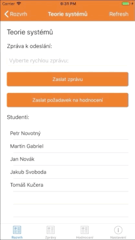

# A Proposed Multiplatform Mobile Application for Rapid Communication Between Students and Teachers

## What you find here

This is collection of files used to write my bachelor thesis on Tomas Bata University in Zlin. Thesis is written in czech language. Source codes of Xamarin app and .NET Core backend are in [separate repository](https://github.com/martingabriel/bachelor_thesis_code).

Project goal is prototype of multiplatform mobile application for rapid and easy communication between students and teachers based on user timetable. Backend .NET core app get data from UTB information system STAG, but backend should be compatible with the others university information systems based on STAG with the same API.

## Project architecture

Solution is based on Microsoft technologies like .NET Core, Azure, Xamarin, and many others.


Core features:

1. **.NET Core server app**
   - Provide user login
   - Get user data from UTB information system STAG
   - API for Xamarin app with UI in Swagger
   - Send push-notifications via NotificationHub
- Store data in MSSQL DB
   
2. **Xamarin multiplatform App**
   - View data from .NET Core server API
   - Send messages to multiple users (via server API)
   - Receive messages from server as push-notifications
   - Rate lections based on user timetable
   - View live rating of lections

## How to use

1. Create NotificationHub on Azure and copy connection strings from Access Policies.
2. Setup connection strings to notification hub in StudentsNotifier.iOS in class AppDelegate.cs:

```
public class Constants
{
    // Azure app-specific connection string and hub path
    public const string ConnectionString = "put your hub connection string here";
    public const string NotificationHubPath = "put name of you hub here";
}
```

3. Setup connection strings to notification hub in StudentsNotifier.MobileAppService in class NotificationHubProxy.cs:

```
string connectionString = "put your connection string here";
string hubName = "put name of your hub here";
```

4. Generate certificate for push notifications based on your bundle ID and put it to Azure NotificationHub.
5. Create Mobile App Service on Azure and build/publish StudentsNotifier.MobileAppService to Azure.

Warning: This prototype API is not secured. All data are open and messages are in plaintext. Keep it in mind if you want to use this prototype. Pull requests are welcome. 😍

## Prototype examples

Send message to students:


> Message is send only to users in list.

Receive message as push notification on real device:


Lection rating request:



Send anonymous votes to lection rating:


Note: This is prototype of architecture, not sample of production UI or API.

## Thanks ♥️

Big thanks to [@ekral](https://github.com/ekral) for management of this bachelor thesis.

Also thanks to Tomas Bata Univesity in Zlin - Faculty of Applied Informatics for whole education. 